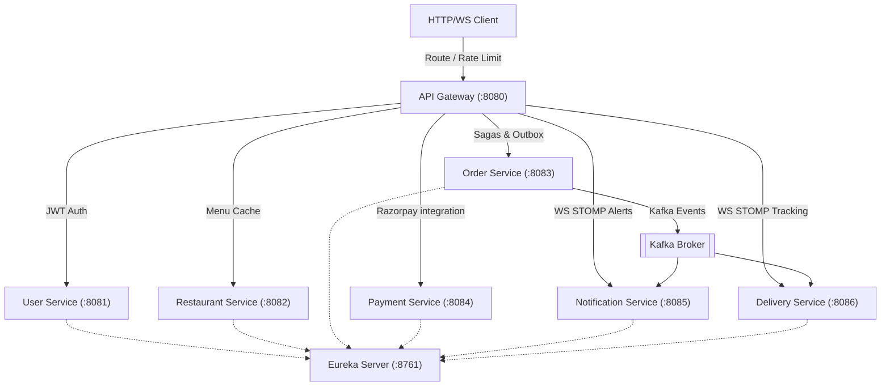

# QuickEats Microservices Platform

QuickEats is a portfolio-grade, reference-implementation microservices platform built using **Java 21/25**, **Spring Boot 3.3.x**, and **Spring Cloud 2023.0.x**. It models an end-to-end food delivery application comprising authentication, restaurant and menu catalogs, saga-orchestrated order and payment flows, real-time proximity delivery-matching via Redis Geo, and live STOMP WebSocket tracking.

---

## 🏗️ Architecture & Topology

The platform coordinates multiple specialized microservices communicating both synchronously (via REST) and asynchronously (via Kafka events):



---

## 🛠️ Technology Stack

* **Java Version**: JDK 21 / 25
* **Core Framework**: Spring Boot 3.3.5, Spring Cloud 2023.0.3 (Eureka Server, Config Server, Cloud Gateway)
* **Databases**: PostgreSQL (User, Order, Payment, Delivery) & MongoDB (Restaurant & Menu catalog)
* **Message Broker**: Apache Kafka (KRaft mode)
* **Cache & Geo-indexing**: Redis (Menu Cache & Delivery Partner Proximity Matching)
* **Observability**: Prometheus (Metrics scraping), Grafana (Visualization dashboards), and Zipkin (Distributed tracing)
* **Third-Party APIs**: Razorpay (Test mode payments) & Resend (Onboarding email alerts)
* **Database Migrations**: Flyway

---

## 🚀 Running the Platform

### 1. Prerequisites
Ensure you have the following installed on your development machine:
* [Docker Desktop](https://www.docker.com/products/docker-desktop/)
* [JDK 21 or higher](https://adoptium.net/)

### 2. Start Backing Services (Docker)
Start the PostgreSQL, MongoDB, Redis, Kafka, Zipkin, Prometheus, and Grafana containers:
```bash
docker-compose up -d
```
Verify all 8 containers are running successfully using `docker ps`.

### 3. Compile the Services
Use the root Maven wrapper to clean and package all services:
```bash
.\mvnw clean package -DskipTests
```

### 4. Boot the Microservices
Start the microservices in the following logical order:
1. **Discovery Server** (`discovery-server`)
2. **Config Server** (`config-server`) — *ensure this has started successfully before launching others*
3. **API Gateway** (`api-gateway`)
4. **All Core Services**: `user-service`, `restaurant-service`, `order-service`, `payment-service`, `delivery-service`, and `notification-service`.

---

## 🔍 Verification & Dashboards

* **Service Registry UI**: [Eureka Dashboard](http://localhost:8761)
* **API Documentation**: [Consolidated Gateway Swagger UI](http://localhost:8080/swagger-ui.html)
* **Distributed Tracing UI**: [Zipkin Dashboard](http://localhost:9411)
* **Metrics Scraper Target Health**: [Prometheus Server](http://localhost:9090)
* **Observability Dashboards**: [Grafana Console](http://localhost:3000) (Default Credentials: `admin` / `admin`)
  * Navigating to the pre-loaded **QuickEats Microservices Dashboard** lets you monitor service instance status, latency, request throughput, CPU, and memory graphs out of the box.

---

## 📖 Comprehensive Step-by-Step Walkthrough
For a detailed end-to-end integration scenario (registering users, seeding menus, matching active delivery partners, placing orders, executing payments, and tracking location updates via WebSockets), refer to the consolidated walkthrough document:
👉 [quickeats_complete_walkthrough.md](file:///C:/Users/Srinivasa%20Prabhu/.gemini/antigravity-ide/brain/43e0c42c-6a64-42f7-90be-9673744836f3/quickeats_complete_walkthrough.md)
