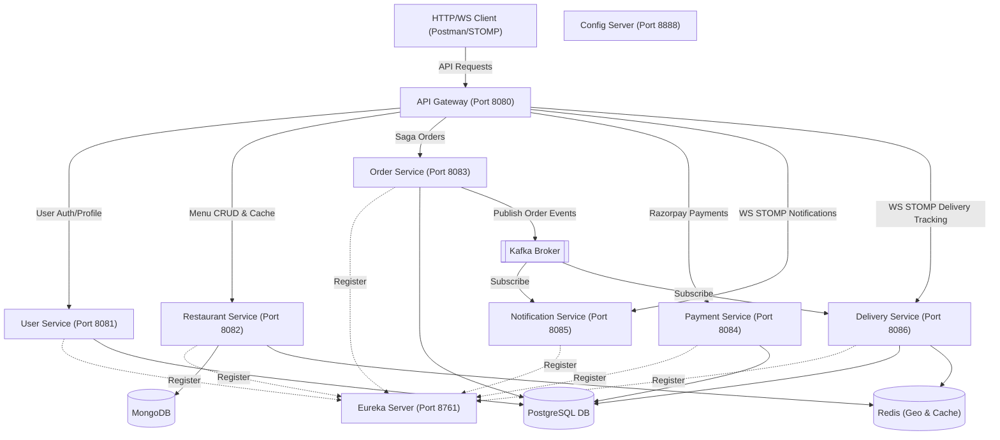

# QuickEats Complete Walkthrough & Verification Plan

This document serves as the master guide and verification plan for the **QuickEats** microservices platform. It describes the end-to-end architecture, step-by-step instructions to run the platform, and complete verification scenarios.

---

## 🏗️ System Architecture

The following diagram illustrates how the QuickEats microservices, databases, and message brokers interact:



---

## 🛠️ Microservice Portfolio

The platform comprises the following Spring Boot services (using **Java 21/25**, **Spring Boot 3.3.x**, and **Spring Cloud 2023.0.x**):

1. **Discovery Server (`discovery-server` @ `8761`)**: Eureka discovery server.
2. **Config Server (`config-server` @ `8888`)**: External configurations server pointing to local `config-repo`.
3. **API Gateway (`api-gateway` @ `8080`)**: Entrypoint routing REST & WebSockets traffic, applying JWT security headers, rate-limiting, and aggregating OpenAPI docs.
4. **User Service (`user-service` @ `8081`)**: User credential profiles, BCrypt security, JWT generation, Postgres DDLs via Flyway.
5. **Restaurant Service (`restaurant-service` @ `8082`)**: MongoDB restaurant and menu CRUD, cached with Redis eviction rules.
6. **Order Service (`order-service` @ `8083`)**: SQL database order tracking, transactional outbox pattern to guarantee event publishing to Kafka, and saga orchestrator handling Razorpay test payment capture and compensating flows.
7. **Payment Service (`payment-service` @ `8084`)**: Razorpay SDK test mode payment processing, idempotency headers checking, and Razorpay Refund API orchestration.
8. **Delivery Service (`delivery-service` @ `8086`)**: Redis Geo match algorithm for delivery partners, persistent Postgres runs, and STOMP live coordinate tracking streams.
9. **Notification Service (`notification-service` @ `8085`)**: Resend API email sender and STOMP user notification fanner-out subscribing to Kafka topics.

---

## 🏁 Step-by-Step Boot Instructions

### Step 1: Boot Backing Infrastructure
Make sure Docker Desktop is active. Run the following command from the root workspace directory to boot backing engines and observability servers:
```bash
docker-compose up -d
```
Verify that all 8 containers are running and operational (`docker ps`):
* `quickeats-postgres` (PostgreSQL 16)
* `quickeats-mongodb` (MongoDB 7.0)
* `quickeats-redis` (Redis 7.2)
* `quickeats-kafka` (Kafka/KRaft)
* `quickeats-zipkin` (Zipkin tracing)
* `quickeats-prometheus` (Prometheus metrics scraper)
* `quickeats-grafana` (Grafana dashboard metrics)

### Step 2: Build Microservices
Use the Maven Wrapper script in the root directory to compile and package all modules:
```bash
.\mvnw clean package -DskipTests
```

### Step 3: Run the Microservices
Start the microservices in your IDE or terminal. For optimal startup, launch them in the following order:
1. `discovery-server`
2. `config-server` (wait for port `8888` to listen)
3. `api-gateway`
4. `user-service`, `restaurant-service`, `order-service`, `payment-service`, `notification-service`, `delivery-service`

Verify that all services are registered successfully on the Eureka Dashboard: `http://localhost:8761`.

---

## 🧪 Consolidated Swagger API Documentation

Open your browser and navigate to:
```url
http://localhost:8080/swagger-ui.html
```
You can toggle between **User Service**, **Restaurant Service**, **Order Service**, **Payment Service**, and **Delivery Service** definitions via the select group dropdown at the top right of the screen.

---

## 🔬 End-to-End Verification Scenario

Follow this step-by-step sequence to verify the entire platform, databases, queues, sagas, caching, geo-location, and observability dashboards.

### Phase A: User Creation & JWT Token Fetching
Create a test client user account.

#### 1. Register User
* **URL**: `POST http://localhost:8080/api/v1/auth/register`
* **Headers**: `Content-Type: application/json`
* **Request Payload**:
```json
{
  "username": "prabhu",
  "password": "securepassword",
  "email": "prabhu-ai-projects@hotmail.com",
  "role": "CLIENT"
}
```
* **Verify**: Receive `201 Created` status indicating successful account registration.

#### 2. Log in User (JWT Generation)
* **URL**: `POST http://localhost:8080/api/v1/auth/login`
* **Headers**: `Content-Type: application/json`
* **Request Payload**:
```json
{
  "username": "prabhu",
  "password": "securepassword"
}
```
* **Verify**: Receive `200 OK` response with a JSON object containing the JWT token.
* **Important**: Copy this JWT token; it must be passed in the `Authorization: Bearer <TOKEN>` header for all subsequent API requests.

---

### Phase B: Register Restaurant, Menu, and Delivery Partner

#### 1. Create a Restaurant
* **URL**: `POST http://localhost:8080/api/v1/restaurants`
* **Headers**:
  * `Authorization: Bearer <JWT_TOKEN>`
  * `Content-Type: application/json`
* **Request Payload** (Sets latitude/longitude near Bangalore center):
```json
{
  "name": "Quick Bites",
  "cuisineType": "Italian",
  "address": "123 MG Road, Bangalore",
  "longitude": 77.5946,
  "latitude": 12.9716
}
```
* **Verify**: Capture response including generated restaurant `"id"` (e.g., `"60b5e9..."`).

#### 2. Add Menu Item
* **URL**: `POST http://localhost:8080/api/v1/restaurants/{restaurantId}/menu`
* **Headers**:
  * `Authorization: Bearer <JWT_TOKEN>`
  * `Content-Type: application/json`
* **Request Payload**:
```json
{
  "name": "Margherita Pizza",
  "price": 299.00,
  "description": "Classic tomato, cheese, and basil"
}
```
* **Verify**: Receive `201 Created` returning the menu item list.

#### 3. Register Active Delivery Partner
* **URL**: `POST http://localhost:8080/api/v1/deliveries/partners/active`
* **Headers**:
  * `Authorization: Bearer <JWT_TOKEN>`
  * `Content-Type: application/json`
* **Request Payload** (Seeds coordinate within 1km of restaurant):
```json
{
  "partnerId": "delivery-guy-1",
  "latitude": 12.9720,
  "longitude": 77.5950
}
```
* **Verify**: Status code `201 Created`. The coordinate is indexed in Redis Geo key `delivery:partners:active`.

---

### Phase C: Order Saga, Payments, and Kafka Events

#### 1. Place Order
* **URL**: `POST http://localhost:8080/api/v1/orders`
* **Headers**:
  * `Authorization: Bearer <JWT_TOKEN>`
  * `Content-Type: application/json`
* **Request Payload**:
```json
{
  "restaurantId": "60b5e9...",
  "items": [
    {
      "name": "Margherita Pizza",
      "quantity": 1
    }
  ]
}
```
* **Verify**:
  * `order-service` validates the item names and prices against `restaurant-service`.
  * Persists order in Postgres `orders` table with status `CREATED`.
  * Outbox record is published to Kafka topic `order-events` with status `CREATED`.
  * `payment-service` registers transaction as `PENDING`.

#### 2. Process Razorpay Payment
To simulate successful card/UPI capture via Gateway:
* **URL**: `POST http://localhost:8080/api/v1/payments/charge`
* **Headers**:
  * `Authorization: Bearer <JWT_TOKEN>`
  * `Content-Type: application/json`
* **Request Payload**:
```json
{
  "orderId": 1,
  "amount": 299.00,
  "method": "CARD",
  "idempotencyKey": "idem-key-order-1"
}
```
* **Verify**:
  * Returns successful Razorpay Payment signature verification payload.
  * Status transitions to `PAID` in database and Outbox publishes a `PAID` Kafka event.
  * Check email log / Resend dashboard: user receives order confirmation notification.

---

### Phase D: Proximity Matching & Live WebSockets Tracking

#### 1. Verify Proximity Assignment
Once the payment transitions to `PAID`, `delivery-service` consumes the Kafka event:
* **Check database**:
  `GET http://localhost:8080/api/v1/deliveries/order/1`
* **Verify**:
  * Active partner `delivery-guy-1` was automatically matched and status is `ASSIGNED`.
  * `delivery-guy-1` is removed from Redis active pool to avoid double booking.

#### 2. Track Live Coordinates Updates
* **Connect WebSocket**:
  * Point a STOMP WebSocket client (e.g. Chrome Extension `STOMP Web Socket Client` or a script) to:
    `ws://localhost:8080/ws-delivery`
  * Subscribe to destination: `/topic/delivery/1`
* **Update Partner Location**:
  Submit coordinate telemetry:
  * **URL**: `POST http://localhost:8080/api/v1/deliveries/1/location`
  * **Request Payload**:
    ```json
    {
      "latitude": 12.9730,
      "longitude": 77.5960,
      "status": "PICKED_UP"
    }
    ```
  * **Verify**:
    * STOMP subscription instantly receives a text frame updating the partner's location and status:
      ```json
      {
        "deliveryId": 1,
        "orderId": 1,
        "partnerId": "delivery-guy-1",
        "status": "PICKED_UP",
        "latitude": 12.9730,
        "longitude": 77.5960,
        "timestamp": "..."
      }
      ```

#### 3. Complete Delivery Run
* **URL**: `POST http://localhost:8080/api/v1/deliveries/1/complete`
* **Verify**:
  * Returns `200 OK`.
  * Database status is updated to `DELIVERED`.
  * STOMP client receives terminal tracking packet.

---

## 📊 Observability Verification

* **Eureka Server**: Check service registry states at `http://localhost:8761`.
* **Zipkin Distributed Tracing**: Go to `http://localhost:9411`. Click "Run Query" to trace trace spans of the inter-service call chain from API Gateway to Order, Restaurant, and Payment services.
* **Prometheus Targets**: Visit `http://localhost:9090/targets` to verify Prometheus is scraping metrics from all 9 microservices.
* **Grafana Dashboard**: Go to `http://localhost:3000` (credentials: `admin` / `admin`). Open the provisioned **QuickEats Microservices Dashboard** to view live system JVM charts and order throughput.
