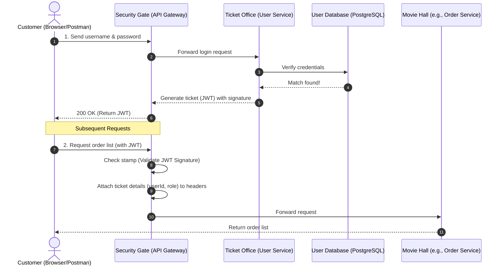
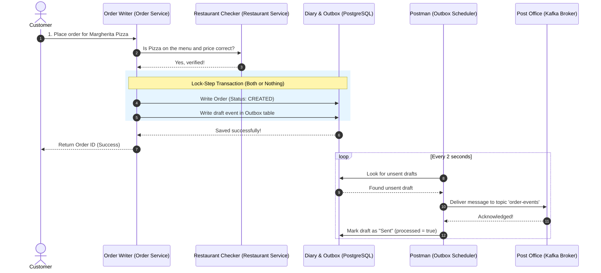
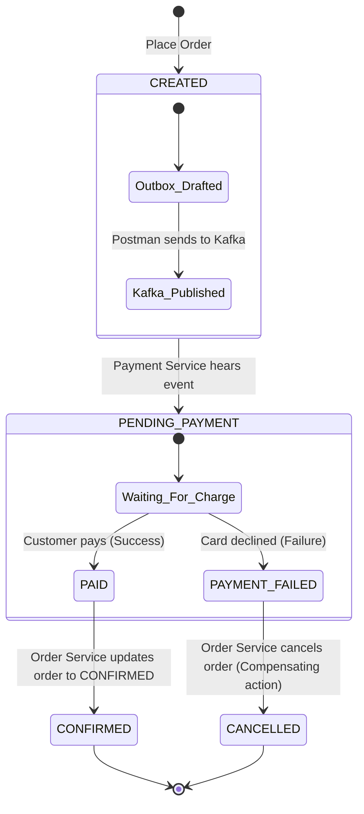
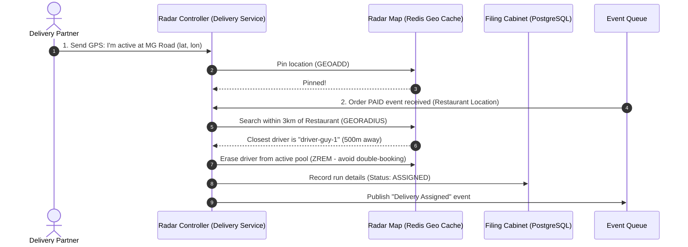
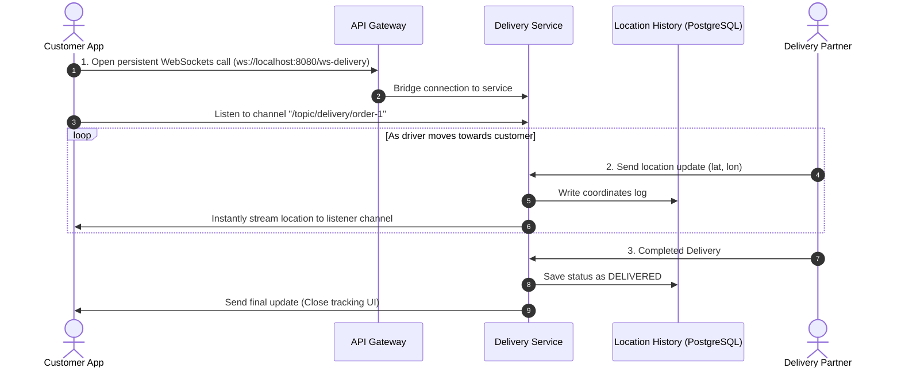

# QuickEats Microservices - Functional End-to-End Flows (Beginner's Guide)

Welcome to the QuickEats architecture guide! If you are new to microservices, don't worry. This document explains how the system works behind the scenes using **simple real-world analogies** and **step-by-step descriptions** alongside technical diagrams.

---

## 1. User Authentication & Gateway Session Flow

### 💡 The Analogy: The Movie Ticket
Imagine going to a movie theater. 
1. You show your ID and pay at the ticket counter (**User Service**).
2. They give you a ticket stub (**JWT Token**). 
3. When you walk into the halls (**Downstream Services**), the ticket checkers (**API Gateway**) look at the theater's official stamp on your ticket. They don't need to call the ticket counter to verify who you are every time; they trust the stamp.

### 🚶 Step-by-Step Flow:
1. **Logging In**: You send your credentials (username/password) to the API Gateway. The Gateway forwards them to the **User Service**, which verifies them against the PostgreSQL database.
2. **Receiving a Token**: If details match, the User Service signs and generates a **JWT (JSON Web Token)** and returns it to you.
3. **Accessing Secured Features**: For all future requests, you include this token. The **API Gateway** checks the token's signature. If valid, it extracts your user ID and forwards the request to downstream services (like the Order Service).

---

## 2. Order Placement & Transactional Outbox Pattern

### 💡 The Analogy: The Diary & The Postman
When you order food, two things must happen:
1. The order must be saved in our system (**PostgreSQL Database**).
2. A notification must be sent to the kitchen and drivers (**Kafka Broker**).

If we save the order but the network fails before notifying the kitchen, the customer gets charged for food that is never cooked. If we notify the kitchen but the database fails, the kitchen cooks food that doesn't exist in our system.

To solve this, we use the **Outbox Pattern**:
* You write the order details in your **Order Book** AND write a draft letter in your **Outbox Drafts Folder** (both in PostgreSQL) at the *exact same time*. If you drop your pen, both are discarded (rolled back).
* A postman (**Outbox Scheduler**) checks the Outbox folder every 2 seconds. When he finds a draft, he delivers it to the post office (**Kafka**) and marks the draft as "Sent" in the book.

### 🚶 Step-by-Step Flow:
1. **Validation**: The **Order Service** verifies with the **Restaurant Service** that the item exists and the price is correct.
2. **Atomicity**: The Order Service writes the order to the `orders` table AND a message to the `outbox_events` table inside a single database transaction.
3. **Event Delivery**: The [OutboxScheduler](file:///e:/Learning/antigravity-projects/springboot-app/order-service/src/main/java/com/quickeats/orderservice/scheduler/OutboxScheduler.java) scans the database, finds the unsent event, publishes it to Kafka, and marks it as processed.

---

## 3. Order Saga & Payment Orchestration

### 💡 The Analogy: Booking a Vacation
When booking a trip, you book a hotel first, then a flight. If the flight booking fails, you must cancel the hotel booking to get your money back. This is called a **Saga**.

### 🚶 Step-by-Step Flow:
1. **Order Initialized**: The order starts as `CREATED`.
2. **Payment Listens**: The **Payment Service** listens to Kafka and sets up a `PENDING` transaction.
3. **Payment Collection**:
   * **If Payment Succeeds**: The payment status changes to `PAID`. A Kafka message is sent, and the **Order Service** updates the order status to `CONFIRMED`.
   * **If Payment Fails**: A `PAYMENT_FAILED` event is published. The **Order Service** catches this event and performs a **compensating transaction** (automatically transitioning the order status to `CANCELLED` so you aren't stuck with an unpaid order).

---

## 4. Proximity Matching via Redis Geo

### 💡 The Analogy: The Digital Radar Screen
Imagine a radar drawing a circle around a restaurant to find the nearest delivery driver.
1. Drivers constantly pin their GPS coordinates on our radar map (**Redis Geo Index**).
2. When an order is ready, we set the restaurant as the center point.
3. We scan a 3km radius to find the closest active driver's dot.

### 🚶 Step-by-Step Flow:
1. **Active Drivers**: Drivers register their locations in Redis using the `GEOADD` command under `delivery:partners:active`.
2. **Proximity Search**: Upon order payment, the **Delivery Service** runs a `GEORADIUS` query centering on the restaurant coordinates.
3. **Locking the Driver**: The nearest driver is selected, and their ID is removed (`ZREM`) from active search pool so they aren't assigned multiple orders simultaneously.

---

## 5. Real-Time Telemetry & STOMP WebSockets Tracking

### 💡 The Analogy: A Continuous Phone Call
In old web apps, to see where your food is, the browser had to ask the server "where is the driver now?" every few seconds (**Polling**). This wasted energy.
With **WebSockets (STOMP)**, it is like a phone call that stays open. Once the call is connected, the server continuously whispers the driver's coordinates to the client without the client asking.

### 🚶 Step-by-Step Flow:
1. **Establish Channel**: The customer's browser initiates a WebSocket connection through the **API Gateway** to the **Delivery Service** and subscribes to `/topic/delivery/{orderId}`.
2. **Telemetry Updates**: As the driver drives, their app sends GPS coordinate packets (`POST /deliveries/{id}/location`).
3. **Broadcasting**: The Delivery Service saves the location in PostgreSQL and broadcasts the coordinates over the active WebSocket channel. The customer's map updates in real time.
